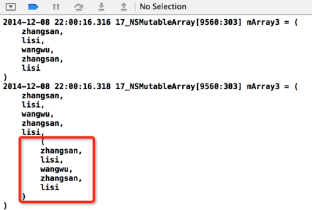

# NSArray类和NSMutableArray类
NSArray类(类似C++数组)和NSMutableArray类(类似c++ vector)


##NSArray类  
###创建方法
```
//1.---------------------数组的创建  
        NSString *s1 = @"zhangsan";  
        NSString *s2 = @"lisi";  
        NSString *s3 = @"wangwu";  
        //最后的nil相当于结束的标记  
        NSArray *array1 = [[NSArray alloc] initWithObjects:s1,s2,s3, nil nil];  
        //打印的时候会调用description方法  
        //相当于:array1.description  
        NSLog(@"%@",array1);  
          
        //使用类方法创建  
        array1 = [NSArray arrayWithObjects:s1,s2,s3, nil nil];  
          
        //创建一个数组，将源数组中的数据拿出来放进去  
        NSArray *array2 = [NSArray arrayWithArray:array1];  
```
Xcode4.4之后新增了NSArray快速创建的一种方式
```
    //xcode4.4以后，编译器对数组的创建和访问语法做了优化  
    NSArray *array7 = @[s1,s2,s3];  
    NSString *s = array7[0];  
```
###使用下标访问元素
```
//2.----------------------objectAtIndex  
//访问数组中的数据，数组中存放的是对象的指针  
NSString *str1 = [array1 objectAtIndex:0];
```
###获取数组的大小
```
    //3.----------------------count  
    //获取数组元素中的个数  
    NSUInteger count = [array1 count];//返回的是一个无符号数值  
```
###是否包含某一个元素
```
    //4.----------------------containsObject  
    //判断数组中是否包含某一个对象,判断的是指针对象值，不是对象中的值  
    BOOL isContains = [array1 containsObject:@"zhangsan"];  
```
###找到一个元素在数组中的下标
```
//5.----------------------indexOfObject  
//返回一个对象在数组中的下标值  
NSUInteger index = [array1 indexOfObject:@"zhangsan"];  
if(index == NSNotFound){  
    //没有找到  
}else{  
    //找到了  
} 
```
###使用指定的连接符连接数组中所有的元素
```
    //6.----------------------componentsJoinedByString  
    //数组中存放的如果是字符串的话，可以使用连接符将其所有的元素进行连接  
    //注意数组中的元素必须都是字符串  
    NSString *content = [array1 componentsJoinedByString:@","];  
```
###在数组的尾部增加一个元素
```
    //8.----------------------arrayByAddingObject  
    //在原来的数组后面追加元素,返回一个新的数组对象，因为他是不可变的  
    NSArray *array3 = [array1 arrayByAddingObject:@"zhaoliu"];  
```
###数组的遍历  
```
//数组的遍历  
for(int i=0;i<array1.count;i++){  
    NSString *str = [array1 objectAtIndex:i];  
    NSLog(@"%@",str);  
}  
  
//快速遍历  
for(NSString *s in array1){  
    NSLog(@"%@",s);  
}
```
##NSMutableArray类

NSArray类是不可变的，NSMutableArray类是可变的，可变类一样的特性，就是可以进行增删改查操作
###创建方法
```
    //1.---------------------创建可变数组  
    NSString *str1 = @"zhangsan";  
    NSString *str2 = @"lisi";  
    NSString *str3 = @"wangwu";  
    NSMutableArray *mArray1 = [[NSMutableArray alloc] initWithObjects:str1,str2,str3, nil nil];  
    //下面的这种方式创建的数组是错误的  
    //下面的这种方式是创建不可变数组的方式，不能用于可变数组的创建  
    //NSMutableArray *array1 = @[str1,str2,str3];  
      
    //先开辟5个空间，用于存储元素，当存储的元素超过了5个，数组会自动增大空间  
    NSMutableArray *mArray2 = [[NSMutableArray alloc] initWithCapacity:5];  
    //使用类方法创建  
    NSMutableArray *mArray3 = [NSMutableArray arrayWithCapacity:5];  
```
创建方式和NSArray类似，但是有一种方式不能用，就是直接创建的方式，那个只能用于创建不变数组。

但是可变数组还有一个方法就是能够事先的设置数组的大小，而且超过这个大小之后，数组会自动扩充，类似于vector的实现。
###添加元素
```
    //2.---------------------addObject  
    //添加元素的方法  
    [mArray1 addObject:str1];  
    [mArray1 addObject:str2];  
    //添加数组，把mArray1中的所有元素全部添加到mArray2中  
    [mArray2 addObjectsFromArray:mArray1];  
    NSLog(@"mArray3 = %@",mArray2);  
              
    //二维数组  
    //这个是将mArray1添加到mArray2数组中，这样mArray2就变成了二维数组了  
    [mArray2 addObject:mArray1];  
    NSLog(@"mArray3 = %@",mArray2);  
```
**使用addObjectsFromArray方法是将一个数组中的每个元素添加到指定的数组中**

**使用addObject方法是讲一个数组整个都添加到指定的数组中了，那么这个数组就变成二维数组了**  

运行结果对比  


###在数组的指定位置上插入元素
```
//3.---------------------insertObject  
//在指定的位置上插入特定元素  
[mArray2 insertObject:@"def" atIndex:0]; 
```