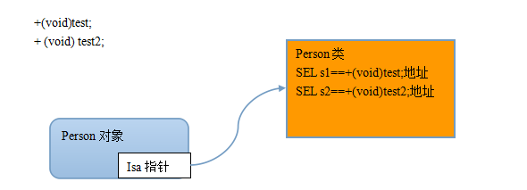

# 闭包和selector
代理模式内有使用selctor
##SEL
SEL是一种数据类型，代表方法签名，通过它就找到这个对象上方法   

个人感觉看上去就是c++的bind和function这类东西，或者理解为函数指针一类的东西   
使用  

1.定义变量 SEL 变量名称  
2.通过@selector(方法名称) 快速生成一个SEL   
3.作为方法的实参   
4.作为方法的形参  
5.作为方法返回值  
oc方法在内存中也是使用sel存储的

